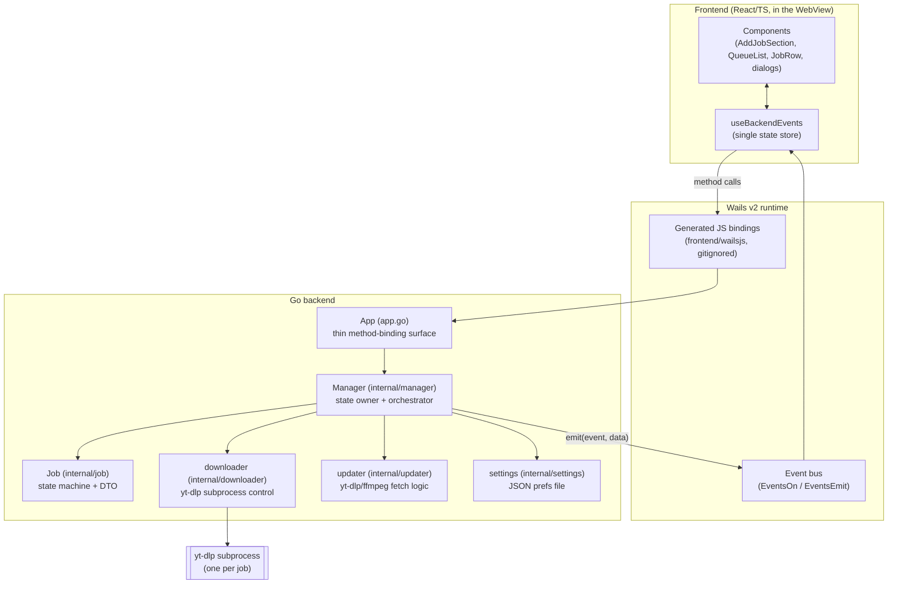
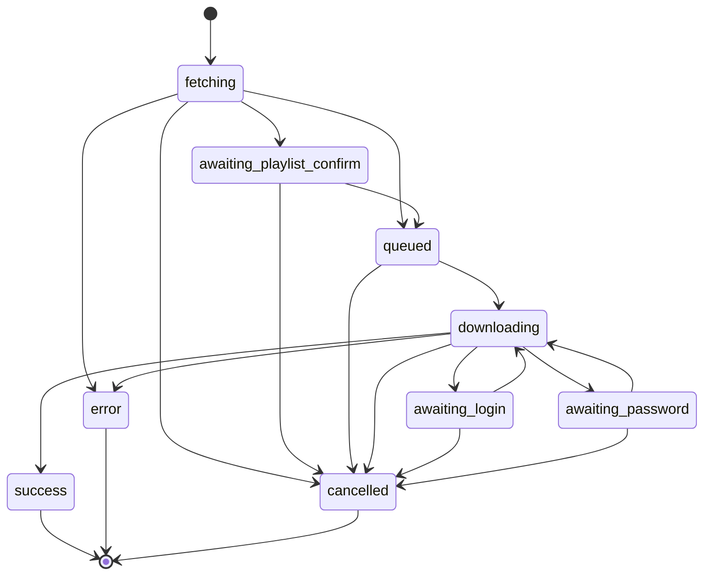
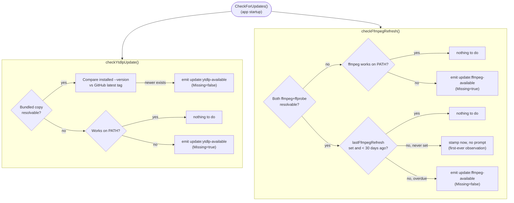

# Video Downloader (Go) — Architecture

This document is a complete map of the repository: every tracked file, what it
does, and how the pieces fit together. It exists as a single reference for
anyone (human or otherwise) getting oriented in the codebase for the first
time.

The project is a **Go + [Wails v2](https://wails.io) + React/TypeScript**
rewrite of an earlier PyQt/QML application
([elyor04/video-downloader](https://github.com/elyor04/video-downloader)).
Comments throughout the Go source explicitly reference the Python modules
they port (`job.py`, `download_manager.py`, `worker_process.py`,
`queue_model.py`, `utils.py`), so the mapping to the original design is
traceable file-by-file.

- **License:** GPLv3 ([LICENSE](LICENSE))
- **Module:** `video-downloader-go` (Go 1.25.0, see [go.mod](go.mod))
- **Author:** Elyor Tukhtamuratov (`tuxtamuratovelyor@gmail.com`)

---

## 1. What the app does

A desktop GUI for downloading video/audio from YouTube, Instagram, TikTok, and
any other site [yt-dlp](https://github.com/yt-dlp/yt-dlp) supports:

- Paste a URL → automatic preview (title + thumbnail) with no separate
  "Fetch" button; Download enables once the preview succeeds.
- Queue of downloads, up to **5 concurrent** (`utils.MaxConcurrentDownloads`),
  the rest wait and start automatically.
- Video or audio mode; resolution ladder narrowed to what the previewed
  video actually offers; optional re-encode (mp4/mkv/webm for video,
  mp3/m4a/wav for audio).
- Playlist detection with a confirm-before-downloading-everything prompt.
- Sign-in / video-password support for gated content, surfaced as modal
  prompts serialized one-at-a-time across all jobs.
- Each download is its own OS subprocess (`yt-dlp`), so one job's crash never
  touches another job or the app; cancelling asks the whole process tree
  (yt-dlp + any ffmpeg it spawned) to stop right away, hard-killing it a few
  seconds later if it doesn't.
- Native OS notification on finish while the window is unfocused.
- Remembers output directory + UI language across restarts.
- UI in English, Russian, Uzbek, switchable live.
- Self-updating: bundled `yt-dlp`/`ffmpeg`/`ffprobe` are fetched at
  build/dev time and the running app checks for newer versions on every
  startup, offering in-place updates.

---

## 2. Tech stack

| Layer | Technology |
|---|---|
| Backend language | Go 1.25 |
| Desktop shell | [Wails v2](https://wails.io) (`github.com/wailsapp/wails/v2 v2.13.0`) — embeds a native WebView, binds Go methods to JS, and provides an event bus |
| Frontend | React 18 + TypeScript, built with Vite 5 |
| UI kit | MUI (Material UI) v9, dark theme only, frameless custom title bar |
| i18n | `i18next` / `react-i18next`, 3 static JSON bundles (en/ru/uz) |
| Download engine | Bundled `yt-dlp` binary, invoked as a subprocess (no Python dependency) |
| Media processing | Bundled `ffmpeg`/`ffprobe`, resolved via `--ffmpeg-location` |
| Notifications | `github.com/gen2brain/beeep` (cross-platform native notifications) |
| Packaging | Wails' own bundler; NSIS installer for Windows; Info.plist for macOS |

---

## 3. Full repository layout

Every file tracked in git (`git ls-files`), annotated:

```
.gitignore                                 — excludes build output, node_modules, bin/ (fetched binaries), IDE/OS files, .env
LICENSE                                     — GPLv3 full text
README.md                                   — user-facing install/build/usage instructions
go.mod / go.sum                             — Go module definition + dependency lockfile
wails.json                                  — Wails project config (frontend build hooks, product name/author)
main.go                                     — process entrypoint; wires Manager <-> Wails window/events
app.go                                      — `App` struct: the thin binding surface exposed to the frontend

internal/
  downloader/
    download.go                             — builds yt-dlp args, runs/retries a download, parses progress
    fetch.go                                 — runs yt-dlp -J for URL preview / pre-queue metadata
    process_unix.go / process_windows.go     — per-OS killTree (hard kill) + cancelTree (soft-then-hard) implementations (SetProcAttrs itself now lives in internal/procutil)
    cleanup.go / cleanup_test.go              — removes a cancelled download's leftover part/intermediate/corrupt files, tracked precisely from yt-dlp's own output rather than by globbing the output directory
    convert.go / convert_test.go              — post-download video conversion cascade (fast remux, falling back to a software re-encode only when necessary), replacing yt-dlp's own --recode-video

  job/
    job.go                                   — Job struct, state machine (validTransitions), DTO for the frontend
    job_test.go                              — exhaustive state-transition tests

  manager/
    manager.go                               — Manager struct: options, startup snapshot, shutdown
    jobs.go                                   — preview lifecycle, add-job, concurrency scheduler, cancel/remove
    prompts.go                                — serialized playlist/login/password modal-prompt queue
    notify.go                                 — native OS notification on job completion (only if unfocused)
    updates.go                                — startup + on-demand yt-dlp/ffmpeg update checking & confirmation
    manager_test.go                           — unit tests for options/login/password/resolution logic
    updates_test.go                           — unit tests for the update-checking state machine (fakes network/FS)
    assets/app-icon.png                       — embedded PNG passed to beeep.Notify as the notification's icon

  procutil/
    procutil_unix.go / procutil_windows.go   — shared per-OS exec.Cmd attribute setup (hide console window on Windows, own process group) used by both downloader and updater

  settings/
    settings.go                              — tiny JSON-file persistence for outputDir/language/lastFfmpegRefresh

  updater/
    ytdlp.go                                  — GitHub release lookup + download for yt-dlp
    ffmpeg.go                                 — BtbN (Windows/Linux) + evermeet.cx (macOS) ffmpeg/ffprobe fetch & extract
    ytdlp_test.go / ffmpeg_test.go            — unit tests against httptest fakes + re-exec'd fake binaries

  utils/
    utils.go                                  — shared constants, path resolution, formatting, dir-permission checks
    utils_test.go                             — unit tests for formatting/dir-check helpers

tools/
  fetchytdlp/main.go                          — CLI: fetch latest yt-dlp into bin/ (build/dev-time + `go generate`)
  fetchffmpeg/main.go                         — CLI: fetch latest ffmpeg+ffprobe into bin/ (same)

frontend/
  package.json / package-lock.json            — npm project + locked dependency tree
  tsconfig.json / tsconfig.node.json          — TypeScript project config (app code vs. Vite config)
  vite.config.ts                              — Vite + @vitejs/plugin-react config
  index.html                                  — SPA HTML shell, mounts src/main.tsx
  src/
    main.tsx                                  — React root: ThemeProvider + i18n + ErrorBoundary + App
    App.tsx                                   — top-level layout: title bar, add-job form, queue list, modal precedence
    theme.ts                                   — MUI dark theme (palette, shape, component style overrides)
    types.ts                                   — shared TS types for prompts/preview/options state
    vite-env.d.ts                               — Vite client type reference
    hooks/
      useBackendEvents.ts                       — single source of truth: loads initial state, subscribes to all Wails events
    i18n/
      index.ts                                  — i18next init (en/ru/uz resources)
      en.json / ru.json / uz.json                — translation bundles (structurally identical keys)
    components/
      AddJobSection.tsx                          — URL input, debounced preview, mode/resolution/convert/output controls
      JobRow.tsx                                  — one queue row: thumbnail, progress bar, status text, action buttons
      QueueList.tsx                                — renders JobRow list or an empty-state message
      Modal.tsx                                    — shared MUI Dialog wrapper (title/children/actions)
      ErrorDialog.tsx                              — generic error modal
      LoginDialog.tsx                              — username/password modal for gated sign-in
      PasswordDialog.tsx                            — video-password modal
      PlaylistConfirmDialog.tsx                     — "download whole playlist?" modal
      UpdateDialog.tsx                              — yt-dlp/ffmpeg update-available/missing modal
      TitleBar.tsx                                  — custom frameless-window title bar (drag region, min/max/close)
      ErrorBoundary.tsx                             — top-level React error boundary with reload button
    assets/
      app-icon.png                                  — 1024x1024 app icon used in the title bar

build/
  README.md                                   — Wails-generated notes on this directory's purpose
  appicon.png                                 — 1024x1024 source icon Wails derives platform icons from
  darwin/
    Info.plist / Info.dev.plist                — macOS bundle metadata templates (build vs. dev)
    package.sh                                  — hand-maintained: copies bin/{yt-dlp,ffmpeg,ffprobe} into the built .app, re-signs it, wraps it in a .dmg via create-dmg
  windows/
    icon.ico                                    — Windows executable icon
    info.json                                   — Windows version-info resource template
    wails.exe.manifest                           — Windows app manifest (DPI awareness, common-controls dependency)
    installer/
      project.nsi                                — NSIS installer script (this project's customizations)
      wails_tools.nsh                             — Wails-generated NSIS macros (regenerated by `wails build`)
      tmp/MicrosoftEdgeWebview2Setup.exe          — WebView2 bootstrapper bundled into the installer
```

`bin/` (fetched `yt-dlp`/`ffmpeg`/`ffprobe` binaries), `build/bin/` (build
output), `frontend/dist/` and `frontend/node_modules/`, and
`frontend/wailsjs/` (generated Go↔TS bindings) are all gitignored and
regenerated by tooling — see §7.

---

## 4. High-level architecture



**Key design decision:** `App` (app.go) is intentionally a *thin delegator*.
It exists only so Wails' method-binding reflection exposes exactly the
methods the frontend should call — binding `*manager.Manager` directly would
also expose `SetEmitter`/`SetBrowseDirFunc` (Go-only wiring called once from
`main.go`) to JavaScript.

All real state and logic lives in `Manager`, protected by a single mutex
(`Manager.mu`). Every public method locks, mutates, builds a snapshot/DTO,
unlocks, then emits an event — never holding the lock while calling `emit`
(which could run frontend-triggered re-entrant calls).

---

## 5. Backend: package-by-package

### 5.1 `internal/job` — the state machine

`Job` is a plain struct (ID, URL, mode, resolution, convert target, output
dir/filename, current state, title/thumbnail, progress fields, playlist
info, error message). It carries **no OS process handles** — those live in
the Manager — keeping this package free of concurrency concerns.

States (`job.State`):



`SetState` panics on an invalid transition (mirroring the original Python's
`assert`). The Manager always calls into job-mutating code from inside a
`defer recover()`-guarded goroutine, so a bad transition logs and drops that
one goroutine rather than crashing the app.

- `ActiveStates` / `TerminalStates` partition all 9 states (verified by a
  test) and drive the frontend's `canCancel`/`canRemove` flags.
- `Job.ToDTO()` produces the exact JSON shape (`job.DTO`) sent to the
  frontend, including pre-formatted human-readable strings
  (`DownloadedText`, `SpeedText`, `EtaText` via `internal/utils`
  formatters) — this replaces the old `QAbstractListModel::data()` role
  system.

### 5.2 `internal/downloader` — running yt-dlp

Two entry points, both spawning `yt-dlp` as a subprocess with per-OS process
group attributes (`internal/procutil.SetProcAttrs`, shared with
`internal/updater` — see §5.7) so the whole tree (yt-dlp + any child ffmpeg)
can be killed together on cancel (`killTree`/`cancelTree`, still local to
this package since `internal/updater` never needs to kill anything).

- **`Fetch(ctx, ytdlpPath, url)`** — runs `yt-dlp --flat-playlist -J <url>`,
  parses the JSON dump into a `FetchResult` (title, thumbnail, is-playlist,
  playlist count, max available height). Used both for the live URL preview
  and for `AddJob`'s "not previewed yet" fallback path.

- **`Download(ctx, ytdlpPath, params, callbacks)`** — builds the full
  yt-dlp argument list (`buildArgs`) and runs it, streaming stdout/stderr
  line-by-line:
  - **stdout**: `--progress-template` emits one JSON object per progress
    tick (`download:{"progress":...}`) or a bare `CONVERTING` marker for
    postprocessing; `handleStdoutLine` tells these apart by content since
    yt-dlp's template output drops the `download:`/`postprocess:` prefix.
  - **stderr**: scanned for a sign-in requirement (regex `\b[Ss]ign in\b|--username`)
    or a `--video-password` mention. On either, it blocks via
    `Callbacks.RequestLogin`/`RequestPassword` (supplied by the Manager),
    which surfaces a modal prompt and waits for the user's answer or
    context cancellation.
  - On credentials being supplied, the in-flight process is killed and
    **retried once** with `--username`/`--password` or `--video-password`
    appended (`authState` persists across the retry so only one prompt is
    ever shown per job).
  - Cancellation is soft-then-hard: `runAttempt`'s `ctx.Done()` branch
    calls `cancelTree`, which asks the whole process group to stop nicely
    first — `SIGINT` on POSIX, a `CTRL_BREAK_EVENT` scoped to the child's
    own console process group on Windows (`Process.Signal(os.Interrupt)`,
    which Go maps to `GenerateConsoleCtrlEvent`). On POSIX this is
    well-established ffmpeg/yt-dlp behavior: both treat `SIGINT` as their
    normal graceful-stop signal and yt-dlp's Python runtime turns it into a
    `KeyboardInterrupt`, so a cooperative process finishes writing a valid
    output file instead of leaving a truncated one. On Windows, yt-dlp
    still gets an equivalent `KeyboardInterrupt`, but a live test against
    the bundled `ffmpeg.exe` (mid-encode, `CTRL_BREAK` sent, several
    presets tried) showed it exiting within ~300ms every time while still
    leaving a `moov atom not found` file — indistinguishable from an
    immediate hard kill. The step is kept on Windows anyway (cheap, still
    helps yt-dlp's own shutdown, never makes things worse), but its file-
    integrity benefit there is unconfirmed. Either way, if the tree hasn't
    exited within `cancelGracePeriod` (2s), it's escalated to `killTree`'s
    unconditional hard kill. The one exception is app shutdown:
    `internal/manager.Shutdown` cancels each job's context with
    `ErrShutdown` as its cause (`context.CancelCauseFunc`/
    `context.Cause`), which `runAttempt` recognizes and routes straight to
    `killTree` — with the app exiting, nothing is left to wait out a grace
    period for, and doing so anyway would risk an orphaned yt-dlp/ffmpeg
    process outliving the window.
  - A cancelled download's leftovers get cleaned up (`cleanup.go`), unless
    yt-dlp still reports success (`cmd.ProcessState.Success()`) despite the
    cancel signal — a small/fast job can legitimately finish before
    `cancelTree`'s soft-kill has any effect, and that file must survive.
    Otherwise, `runAttempt` removes: the raw per-format download(s) (yt-dlp
    leaves a `.part` file mid-stream, matching `utils.terminate_process_tree`'s
    resumable-by-design behavior — except this app has no resume/pause
    state, so after a real cancel it's just clutter); the merged-or-single
    source file if a convert/recode was requested but didn't finish (yt-dlp
    only deletes it *after* a successful recode, so an interrupted one
    survives as an orphan); and the recode/extract target itself, which a
    live test against the bundled ffmpeg/yt-dlp showed can range from a
    few-byte stub (`moov atom not found`) to, for WAV specifically, a
    *valid but truncated* file (WAV's simple streaming header tolerates a
    size mismatch, unlike MP4/MKV/MP3) — so cleanup never uses "does
    ffprobe accept this file" as its trigger, only "did this job finish."
    The tricky part is naming the right file precisely rather than
    globbing the output directory: yt-dlp's own stdout lines
    (`[download] Destination: ...`, `Deleting original file ...`) can
    silently mangle a title containing characters illegal in a Windows
    filename (verified live: a title with `|` came out as yt-dlp's real,
    correctly-sanitized `｜` substitute on disk, but as two plain spaces —
    the `|` dropped entirely — in the same line's stdout rendering, a
    yt-dlp console-encoding quirk, not something `PYTHONIOENCODING` fixes).
    So the byte-accurate base filename instead comes from
    `--print-to-file "before_dl:%(filename)s"` (writing straight to a file
    sidesteps that console-encoding path), while only the *suffix*
    (format id + extension — always plain ASCII) is taken from stdout.
  - Returns `ErrCancelled` on cancellation, or a cleaned-up single-line
    error message (last non-empty stderr line, `ERROR: ` prefix stripped)
    on failure.

Format-selection logic in `buildArgs`: audio mode uses
`-f bestaudio/best`; video mode uses `--format-sort res~<height>` (height =
requested resolution or `utils.MaxResolution` for "Best"). Every download
also sets `-N`/`--concurrent-fragments` and `--http-chunk-size` (both fixed
constants, `concurrentFragments`/`httpChunkSize`) so fragmented (DASH/
hlsnative) and chunked progressive HTTP downloads both fetch in parallel
rather than serially. Audio convert-to still goes through yt-dlp's own
`-x --audio-format` (cheap, never the bottleneck); video convert-to is
handled by `convert.go` instead of `--recode-video` — see below. Playlists
get `%(playlist_index)s` appended to the output template and omit
`--no-playlist`; everything else gets `--no-playlist`.

**`convert.go` — post-download video conversion.** `--recode-video` only
re-encodes "if necessary" (it does a fast, lossless stream-copy remux
automatically when the source codec is already compatible with the target
container), but yt-dlp has no way to pick faster encoder settings only for
the cases that *do* need a real transcode without also affecting the
free-remux cases — `--postprocessor-args` is appended after yt-dlp's own
codec choice regardless of whether it ends up copying or encoding. So video
convert-to jobs download+merge exactly like `ConvertTo == "original"`
(yt-dlp's default merge container is already `mkv`, which holds effectively
any codec), and `runAttempt` runs its own cascade afterward, once per
downloaded item (`convertDownloaded`, over every line
`readAllDestBaseAndExt` finds in `--print-to-file`'s destination log — a
playlist logs one line per item, and a source file that's missing on disk
is skipped rather than erred, since `before_dl` fires before an item's
download attempt regardless of whether that attempt then succeeds, and
yt-dlp's default `--no-abort-on-error` means one playlist item failing
doesn't stop the rest):

1. **Remux** (`ffmpeg -map 0:v:0 -map 0:a:0? -c copy`) — succeeds whenever
   the source codec is already container-compatible; verified against the
   bundled ffmpeg that this covers essentially every real case except an
   H.264-sourced video converted to `webm` (which requires VP8/VP9/AV1
   video and Vorbis/Opus audio). Explicit stream mapping (required video,
   optional audio via ffmpeg's `?` stream-specifier suffix) avoids an
   unexpected extra stream — e.g. an attached-picture cover-art stream —
   riding along with a blanket `-map 0`.
2. **Software encode** (`videoContainerSpecs`, one recipe per
   `utils.VideoConvertOptions` entry, cross-checked by
   `convert_test.go`) — only reached when the remux fails. Deliberately
   tuned for speed over each encoder's slower quality-favoring defaults
   (`-preset veryfast` for libx264, `-cpu-used 4 -row-mt 1` for the
   notoriously slow-by-default libvpx-vp9), since a hardware-encoder tier
   was scoped out: real testing showed it would almost never trigger given
   this app's three convert-to options and how rarely tier 1 fails on a
   modern ffmpeg build.

`convertVideo`'s own subprocess (`runFFmpeg`) is cancelled the same way
`runAttempt` cancels yt-dlp — `cancelTree`/`killTree`, unchanged, since
both are already generic over any `*exec.Cmd`/pid — and mirrors the same
"a process that finishes successfully right as the cancel signal lands
still counts as a success" tolerance. That tolerance is why `runAttempt`
passes the conversion phase a `context.WithoutCancel` copy of its own ctx
specifically when *yt-dlp itself* (the download+merge step) won successfully
despite a racing cancel: without it, the already-cancelled ctx would abort
the conversion phase before it could even start, leaving a raw, unconverted
file behind instead of finishing the one step still owed to a download that
had, in fact, completed.

### 5.3 `internal/manager` — the orchestrator

The single stateful object (`Manager`), constructed once in `main.go` and
bound into `App`. All fields are guarded by one `sync.Mutex`. Split across
four files by concern:

- **`manager.go`** — struct definition, add-job option setters
  (mode/resolution/convertTo/outputDir/fileName/language), the startup
  snapshot (`GetInitialState`), window-focus tracking, and `Shutdown`
  (cancels every in-flight job's context so its process tree dies before
  Wails exits).

- **`jobs.go`** — the biggest file:
  - **URL preview** (`RequestPreview`/`finishPreview`/`clearPreview`):
    debounced on the *frontend* (matches the original QML
    `Timer{interval:600}`); the Manager itself just cancels any
    in-flight preview fetch when a newer one supersedes it, and discards
    stale results by comparing the fetched URL against the current
    `previewURL`.
  - **`AddJob`**: validates the output dir is writable
    (`utils.CheckDownloadDir`), creates a `Job`, reuses the just-finished
    preview's metadata if the URL matches (skipping a redundant fetch),
    otherwise starts a fresh `Fetch`. Playlists route to the
    confirm-prompt; everything else goes straight to the scheduler.
    Consumes and clears `m.fileName` when building the job, so a custom
    filename applies to exactly one job rather than silently reapplying
    (and colliding with) every job added afterward.
  - **`startFetch`** guards against being re-entered for a job already
    mid-fetch via the `m.fetching` set (no current caller actually does
    this — `AddJob` only ever calls it once per fresh job ID — but it's a
    real, load-bearing guard against a future caller starting two
    overlapping `yt-dlp -J` processes for one job).
  - **Concurrency scheduler** (`scheduleNext`): pulls the next `queued`
    job while `len(active) < utils.MaxConcurrentDownloads`, called after
    every state change that could free up or fill a slot.
  - **Progress plumbing** (`startDownload`/`applyProgress`): progress
    events are throttled to one `job:updated` emit per
    `progressEmitInterval` (80ms) per job — except `"finished"` status,
    which always emits immediately — matching the original's 80ms QTimer
    poll cadence.
  - **Cancel/remove**: `CancelJob` cancels the job's context if a process
    is running (the kill happens inside `downloader`, reported back
    through `finishFetch`/`finishDownload`), or resolves immediately if
    the job has no runtime yet (still queued/awaiting confirm).
    `RemoveJob`/`ClearCompleted` only ever touch terminal-state jobs.

- **`prompts.go`** — a FIFO queue (`pendingPrompts`) ensures only one of
  {playlist-confirm, login, password} is ever shown at a time, across all
  jobs. `requestLoginCallback`/`requestPasswordCallback` are the actual
  functions wired into `downloader.Callbacks`: they transition the job to
  `awaiting_login`/`awaiting_password`, enqueue the prompt, then block on
  a per-job buffered channel (`answerCh`) until
  `SubmitLogin`/`SubmitPassword`/`SkipAuthentication` answers or the job's
  context is cancelled.

- **`notify.go`** — fires a native OS notification via `beeep`, but only
  if the window isn't focused (`SetWindowFocused`, driven by the
  frontend's `focus`/`blur` listeners). Three-language status table
  (finished/failed) since this is the only native-notification surface in
  the app. An `init()` sets `beeep.AppName = "Video Downloader"` (the
  library defaults to the literal string `"DefaultAppName"`, which is
  otherwise what Windows toast/macOS/Linux notifications show as the
  sender); the notification's icon is `assets/app-icon.png` embedded via
  `//go:embed` into a `[]byte` and passed straight to `beeep.Notify`,
  which decodes/converts it to the native icon format per platform itself.

- **`updates.go`** — see §6 below.

### 5.4 `internal/settings` — tiny preferences store

A single JSON file at `<os.UserConfigDir()>/VideoDownloader/settings.json`
holding `outputDir`, `language`, and `lastFfmpegRefresh` (RFC3339
timestamp). `Load()` fails soft (returns zero-value `Settings` on any
error); `Save()` overwrites the whole file. This replaces
`QSettings("elyor04", "VideoDownloader")` from the original.

### 5.5 `internal/updater` — fetch mechanics for yt-dlp/ffmpeg

Shared by both the build-time CLI tools (§7) and the runtime auto-updater
(§6). Owns *how* to fetch, not *when* — no version pinning anywhere; every
call asks upstream what's currently latest.

- **`ytdlp.go`**: maps GOOS/GOARCH → yt-dlp's release asset name
  (`YtdlpAssetName`), queries GitHub's latest-release API
  (`LatestYtdlpVersion`), runs the local binary's `--version`
  (`InstalledYtdlpVersion`), and downloads atomically (temp file + rename,
  execute bit set on non-Windows) via `DownloadYtdlp`.

- **`ffmpeg.go`**: platform-specific sourcing since ffmpeg has no official
  prebuilt binaries:
  - **Windows/Linux**: [BtbN/FFmpeg-Builds](https://github.com/BtbN/FFmpeg-Builds)'
    rolling `latest` GitHub release, GPL variant. Its "latest" tag carries
    several concurrently-maintained version lines at once (e.g. both n7.1
    and n8.1) under hash-free filenames; `LatestFfmpegVersionLine` picks
    the highest line for the current platform via a careful regex
    (`btbnAssetPattern`) that explicitly excludes `-gpl-shared-` and
    `-lgpl-` variants. Downloads a zip (Windows) or tar.xz (Linux, unpacked
    via a shelled-out system `tar` — no xz dependency needed) and extracts
    just `bin/ffmpeg(.exe)`/`bin/ffprobe(.exe)`.
  - **macOS**: [evermeet.cx](https://evermeet.cx)'s JSON "info" API
    directly reports current version + download URL for each of
    ffmpeg/ffprobe separately (Intel/x86_64 build only — runs fine on
    Apple Silicon under Rosetta 2).
  - Both `btbnLatestReleaseURL` and `evermeetInfoBaseURL` are `var`s (not
    `const`s) specifically so tests can redirect them to an
    `httptest.Server`.
  - This package's own `exec.Command` calls (`--version`, `tar -xJf`) use
    `internal/procutil.SetProcAttrs` for the same hidden-console-window /
    process-group treatment as `internal/downloader` — see §5.7.

### 5.6 `internal/utils` — shared constants & helpers

- `MaxResolution = 65535` (sentinel for "Best"); `MaxConcurrentDownloads = 5`.
- `ResolutionLadder` — the fixed 4320p→144p list plus "Best", with i18next
  label keys.
- `VideoConvertOptions` / `AudioConvertOptions` — the format lists shown in
  §1.
- Binary name resolvers (`YtdlpBinaryName`, `FfmpegBinaryName`,
  `FfprobeBinaryName`) — `.exe` suffix on Windows only.
- **`ResolveBundledPath`/`PreferredBinDir`** — the path-resolution scheme
  binaries are found/placed at: next to the running executable's own
  `bin/` (packaged-build layout), directly next to the executable (flat
  fallback), `./bin` under the working directory (dev-mode layout), or
  directly under the working directory (flat fallback). `PreferredBinDir`
  is the write-side counterpart (doesn't require anything to already
  exist) used when a binary is missing entirely.
- **`FFmpegLocation`** — prefers the bundled copy, falls back to `PATH`.
- **`CheckDownloadDir`** — validates (and optionally creates) a directory
  is actually writable by creating+removing a temp file in it; returns a
  stable i18n error key, never a raw OS error string.
- **`OpenInFileManager`** — `explorer`/`open`/`xdg-open` per platform.
- **`FormatBytes`/`FormatSpeed`/`FormatEta`** — human-readable formatting
  (`"1.0 GB"`, `"2.0 KB/s"`, `"1:01:01"`), negative input renders as `"?"`
  (unknown).

### 5.7 `internal/procutil` — shared per-OS subprocess attributes

Extracted out of `internal/downloader` and `internal/updater`, which used to
each carry their own byte-identical `setProcAttrs` implementations. Now a
single `SetProcAttrs(cmd *exec.Cmd)`, exported once per OS
(`procutil_unix.go` / `procutil_windows.go`), used by both packages'
`exec.Command` calls: on Windows it hides the console window a spawned
console app (`yt-dlp`, `ffmpeg`, `tar`, `taskkill`) would otherwise flash
and puts it in its own process group; on POSIX it just sets `Setpgid` so
`internal/downloader`'s `killTree` can take a spawned `ffmpeg` down along
with its `yt-dlp` parent. This package holds no `killTree` itself — only
`internal/downloader` ever needs to force-kill a running subprocess.

---

## 6. Auto-update system (`internal/manager/updates.go`)

Runs in the background from `main.go`'s `OnStartup`, never blocking app
launch. Two independent checks, each in its own goroutine:



- yt-dlp is checked by **version comparison** (its own version string is
  also its release tag).
- ffmpeg has no comparable version string across builds, so it's checked by
  a **30-day time gate** (`ffmpegRefreshInterval`) instead of a version
  diff — BtbN's rolling release can mutate a build without the version
  line changing.
- Every network/subprocess call is timeout-bounded
  (`updateCheckTimeout` = 10s for checks, `updateDownloadTimeout` = 5min
  for the actual download) and fails silently — an outdated-but-present
  binary is a background nicety, not worth surfacing as an error. A
  **missing** binary is different (the app can't function without one) but
  still can't block startup, so it's surfaced the same way: a prompt the
  user answers on their own time via `ConfirmUpdate`.
- `ConfirmUpdate(kind, accept)` runs **synchronously** (unlike the checks)
  so the frontend can `await` it directly and show a spinner
  (`UpdateDialog.tsx`'s `updating` state) — a non-nil Go error return
  becomes a rejected JS promise.
- The `updateChecker` interface abstracts every network/filesystem/PATH
  call the checker makes, so `manager_test.go`/`updates_test.go` can
  substitute a `fakeUpdateChecker` — no test ever hits GitHub, the real
  filesystem, or the real PATH. One test
  (`TestNoDataRaceBetweenJobStartAndMissingBinaryUpdate`) specifically
  guards against a `m.ytdlpPath` race between a job starting and a
  missing-binary prompt resolving concurrently (run with `-race`).

---

## 7. Build-time tooling (`tools/`)

`bin/` is gitignored (18MB+ binaries don't belong in the repo). Two small
CLIs populate it, both wired into `frontend/package.json`'s `postinstall`
script (so `wails.json`'s `frontend:install` → `npm install` runs them
automatically before every `wails dev`/`wails build`), and both re-runnable
by hand via `go generate ./...` (see the directive at the top of `main.go`):

- **`tools/fetchytdlp`**: skip-if-present unless `-force`; otherwise asks
  `internal/updater.LatestYtdlpVersion` + `DownloadYtdlp` for the current
  platform's asset into `<repoRoot>/bin/yt-dlp(.exe)`.
- **`tools/fetchffmpeg`**: same pattern for `internal/updater.RefreshFfmpeg`,
  landing both `ffmpeg` and `ffprobe`.

Both locate the repo root via `runtime.Caller(0)` (their own source file's
path) rather than the process's working directory, since cwd differs
depending on whether they're invoked directly from the repo root or via
`postinstall` (cwd = `frontend/`).

---

## 8. Frontend architecture

### 8.1 Data flow

`useBackendEvents.ts` is the **single source of truth** for all backend
state in the React tree — no other component talks to Wails events
directly. On mount it:

1. Calls `GetInitialState()` once (mode/resolution/convertTo/outputDir/
   language/resolutionOptions/convertOptions/jobs snapshot). i18next itself
   always boots at `'en'` (see `i18n/index.ts`); once this snapshot arrives,
   `i18n.changeLanguage(initial.language)` is called if it differs, so a
   restart actually restores the last-picked language instead of silently
   resetting to English (react-i18next's `useTranslation` subscribes to
   i18next's own language-change event, so this re-renders everything that
   needs it with no further wiring).
2. Subscribes to every backend event (`EventsOn`) and folds each into
   local `useState`, mirroring exactly what `internal/manager` emits (see
   the event catalog below).
3. Separately wires `window.addEventListener('focus'/'blur')` →
   `SetWindowFocused(bool)`, so the backend's notification logic
   (§5.3/`notify.go`) knows whether to fire a native notification.

`App.tsx` reads that single `state` object and renders:
- `TitleBar` (always)
- `AddJobSection` (URL input + options, itself debouncing `RequestPreview`
  calls 600ms after typing stops, mirroring the original QML `Timer`)
- A downloads-list header with **Cancel All** (disabled unless at least
  one job's `canCancel` is true) and **Clear Completed** buttons
- `QueueList` → `JobRow` per job
- **At most one modal**, chosen by an explicit precedence order (documented
  inline in `App.tsx`): playlist-confirm > login > password > ytdlp-update
  > ffmpeg-update > generic error. Live per-job prompts outrank app-level
  update prompts, which outrank the purely informational error dialog.

### 8.2 Components

| Component | Responsibility |
|---|---|
| `TitleBar` | Custom frameless-window chrome: drag region via `--wails-draggable` CSS var, minimize/maximize/close via Wails runtime calls, re-syncs maximized icon on window resize (covers Windows-Snap/keyboard-shortcut restores, not just its own button). Shows the literal, untranslated string `"Video Downloader"` — deliberately not run through `t('app.title')` like `App.tsx`'s own in-content heading, since a native window title bar would show the product name the same way regardless of UI language |
| `AddJobSection` | URL field, video/audio radio, debounced live preview (thumbnail/title/playlist/error), resolution + convert-format selects (options list narrows/resets based on backend state), output-dir browse, filename field, Download button gated on `preview.state === 'ready'` matching the current URL |
| `QueueList` / `JobRow` | List of jobs or an empty-state message; each row shows thumbnail, title, progress bar (indeterminate when progress is negative/unknown), a status line built per-state (`statusLine()` covers all 9 job states + converting sub-stage + playlist-index formatting), and cancel/remove/open-folder buttons gated by the job DTO's `canCancel`/`canRemove`/`canOpenFolder` flags |
| `Modal` | Shared MUI `Dialog` shell (title/children/actions) all other dialogs build on |
| `ErrorDialog`, `LoginDialog`, `PasswordDialog`, `PlaylistConfirmDialog`, `UpdateDialog` | One modal each per prompt type; `UpdateDialog` is the only one with async submit state (spinner while `ConfirmUpdate` is in flight, since that Go call is synchronous/awaited). `ErrorDialog` treats an `error:occurred` payload starting with `"error."` as an i18n key and runs it through `t()`; anything else (yt-dlp/OS error text) is shown verbatim. `LoginDialog`/`PasswordDialog` submit on Enter in their text fields, matching `AddJobSection`'s URL field |
| `ErrorBoundary` | Top-level React error boundary; renders a reload button on any uncaught render error rather than a blank window |

### 8.3 Styling / theming

`theme.ts` defines a single **dark-only** MUI theme: `#121212`/`#1a1a1a`
backgrounds, blue primary (`#2196f3`), custom scrollbar styling, pill-shaped
buttons (`borderRadius: 999`), `borderRadius: 5` elsewhere. `TITLE_BAR_HEIGHT`
(40px) is exported from here since both `TitleBar` and the outer layout need
to agree on it. `main.go` also sets a matching dark background
(`options.NewRGB(18, 18, 18)`) and `windows.Dark` theme so there's no flash
of light content before the WebView paints.

### 8.4 i18n

Three flat JSON bundles under `src/i18n/` (`en.json`, `ru.json`, `uz.json`)
with byte-for-byte identical key structure, loaded eagerly and switched
live via `i18n.changeLanguage()` + the backend's `SetLanguage` (persisted to
`settings.json`, and restored on startup — see §8.1). Numeric resolution
labels (e.g. `"1080p"`) are rendered directly rather than translated; only
the `"Best"` label is a translation key (`resolution.best`). `TitleBar`'s
app name is a deliberate exception that stays untranslated regardless of
language (§8.2).

### 8.5 Build config

- **Vite** (`vite.config.ts`): just the React plugin, no other customization.
- **TypeScript**: strict mode on, `moduleResolution: bundler`, split into
  `tsconfig.json` (app source, `src/`) and `tsconfig.node.json` (Vite's own
  config file, referenced as a project reference).
- **`frontend/wailsjs/`** — Go↔TS bindings (`go/main/App`,
  `runtime/runtime`, `go/models` for `job.DTO`/`utils.ResolutionOption`
  etc.) are **generated by Wails**, not committed (gitignored), regenerated
  on every `wails dev`/`wails build`. All frontend imports from this path
  assume it exists — a fresh clone won't type-check until a Wails command
  has run at least once.

---

## 9. Bound API surface (`app.go`)

Everything the frontend can call, all delegating straight to `Manager`:

| Method | Purpose |
|---|---|
| `GetInitialState()` | Startup snapshot (see §8.1) |
| `SetMode`, `SetResolution`, `ResetResolutionToBest`, `SetConvertTo`, `ResetConvertToOriginal`, `SetOutputDir`, `BrowseOutputDir`, `SetFileName`, `SetLanguage` | Add-job option setters |
| `SetWindowFocused` | Feeds the native-notification focus check |
| `RequestPreview` | Debounced (frontend-side) URL preview |
| `AddJob` | Enqueue a new download |
| `ConfirmPlaylist`, `SubmitLogin`, `SubmitPassword`, `SkipAuthentication` | Answer a pending modal prompt |
| `CancelJob`, `RemoveJob`, `CancelAll`, `ClearCompleted` | Queue management |
| `OpenOutputFolder` | Reveal a finished download in the OS file manager |
| `ConfirmUpdate(kind, accept)` | Answer a yt-dlp/ffmpeg update prompt (synchronous, returns an error to reject the JS promise) |

## 10. Event catalog (`Manager.emit` → `EventsOn`)

| Event | Payload | Fired when |
|---|---|---|
| `preview:changed` | `previewState` | URL preview starts/succeeds/fails/clears |
| `resolution-options:changed` | `[]ResolutionOption` | Preview's max height narrows/resets the ladder |
| `options:changed` | `optionsState` | Mode changes (resolution/convertTo carried along) |
| `output-dir:changed` | `string` | Output directory set/browsed |
| `language:changed` | `string` | Language switched |
| `job:added` | `job.DTO` | A new job is queued |
| `job:updated` | `job.DTO` | Any state/progress change on an existing job |
| `job:removed` | `string` (job ID) | Job removed or cleared |
| `playlist:detected` | `{jobId, count}` | A previewed/fetched URL turns out to be a playlist |
| `login:requested` | `{jobId, url}` | yt-dlp's stderr indicates a sign-in requirement |
| `password:requested` | `{jobId, url}` | yt-dlp's stderr indicates a video-password requirement |
| `prompt:cancelled` | `string` (job ID) | The job behind the currently-shown prompt was cancelled out from under it |
| `update:ytdlp-available` | `UpdatePrompt` | A newer yt-dlp exists, or none can be found at all |
| `update:ffmpeg-available` | `UpdatePrompt` | ffmpeg refresh is overdue, or neither binary can be found at all |
| `error:occurred` | `string` | A preview or generic operation failed |

---

## 11. Packaging (`build/`)

- **Windows**: `wails.exe.manifest` declares per-monitor-v2 DPI awareness
  and a dependency on the common-controls v6 assembly. `info.json` feeds
  the exe's version resource. `installer/project.nsi` is the **hand-
  maintained** part of the NSIS installer (see the long comment block
  inside it explaining the `InstallDir` logic):
  - `InstallDir` is **unconditionally** `%LOCALAPPDATA%\Programs\Video
    Downloader` — not gated behind the `-installscope user` build flag the
    way a fresh `wails init` scaffold would do it. There is no supported
    configuration where a per-machine (`$PROGRAMFILES64`) install would
    actually work: the running app's own auto-updater needs to overwrite
    `bin\yt-dlp.exe`/`ffmpeg.exe`/`ffprobe.exe` in place at runtime, which
    fails under a per-machine install (writable only by admins, while the
    app runs as the invoking user with no elevation). Hardcoding it means
    forgetting `wails build -nsis -installscope user` now only costs an
    unnecessary UAC prompt during install and uninstall info registered at
    HKLM instead of HKCU (`WAILS_INSTALL_SCOPE`, from `wails_tools.nsh`,
    still controls those two cosmetic details) — not a silently broken
    self-updater shipped to every user of that build.
  - Explicitly copies `bin\yt-dlp.exe`/`ffmpeg.exe`/`ffprobe.exe` into
    `$INSTDIR\bin` — these aren't part of Wails' own `wails.files` macro
    (which only packages the Go binary), so without this step
    `utils.ResolveBundledPath` would find nothing and every operation
    would fail looking for those binaries on `PATH`.
  - Bundles the WebView2 bootstrapper (`tmp/MicrosoftEdgeWebview2Setup.exe`)
    and installs it silently if not already present.
  - `wails_tools.nsh` is Wails-generated (regenerated by `wails build
    --nsis`) and is explicitly marked "DO NOT EDIT."
- **macOS**: `Info.plist` (release) / `Info.dev.plist` (dev — adds
  `NSAllowsLocalNetworking` for local dev server access) are Wails template
  files interpolated with product metadata at build time. Unlike Windows,
  Wails' own macOS packaging (`wails build -platform darwin/universal`)
  embeds only the Go binary — nothing copies `bin/yt-dlp`/`ffmpeg`/`ffprobe`
  into the `.app`, so `utils.ResolveBundledPath` would find nothing in a
  distributed bundle. `build/darwin/package.sh` is the macOS counterpart to
  `project.nsi`'s explicit `bin/` copy: it copies the three binaries into
  `Contents/MacOS/bin` (the directory `ResolveBundledPath` checks first,
  since `os.Executable()` resolves to `Contents/MacOS/video-downloader-go`),
  re-signs the bundle (adding files after Wails' own signing invalidates the
  seal — both are ad-hoc, no Developer ID or notarization involved), and
  packages it into a `.dmg` via `create-dmg`.
- **Icons**: `build/appicon.png` (1024×1024) is the master source Wails
  derives all platform-specific icons from; `build/windows/icon.ico`
  (6-size multi-res ICO, largest 256×256) is the pre-baked Windows icon.

---

## 12. Testing

Go unit tests exist for every package with meaningful logic, all avoiding
real network/filesystem/subprocess access via fakes or `httptest`:

- **`internal/job`**: exhaustive transition-table coverage — every valid
  transition succeeds, every invalid one panics, terminal states have no
  outgoing transitions, `ActiveStates`/`TerminalStates` partition all states.
- **`internal/manager`**: option setters, resolution ladder
  narrowing/reset, convert-option validation per mode, double-submit
  no-ops for login/password/skip (regression coverage for a rapid-double-
  click race from the original Python test suite), the full update-check
  state machine (bundled/PATH/missing × up-to-date/outdated/error, for
  both yt-dlp and ffmpeg) against `fakeUpdateChecker`, and one explicit
  `-race`-covered concurrency test guarding `m.ytdlpPath` against a
  read/write race between a starting job and a resolving missing-binary
  prompt.
- **`internal/updater`**: platform→asset-name mapping tables, GitHub/
  evermeet.cx API parsing against `httptest.Server` fakes, BtbN asset-name
  pattern matching (confirms shared/lgpl/wrong-platform builds are
  correctly excluded), and installed-version parsing via the standard
  "re-exec the test binary as a fake CLI" idiom (`TestMain` +
  `UPDATER_TEST_HELPER` env var).
- **`internal/utils`**: byte/speed/ETA formatting edge cases, download-
  directory validation (missing/creatable/not-a-directory/unwritable).
- **`internal/downloader`** (`cleanup_test.go`): pure string/file-plumbing
  coverage for the cancel-cleanup logic — parsing yt-dlp's stdout lines
  into tracked suffixes (including the "Deleting original file" removal
  and unrecognized-line no-op cases), splitting a `--print-to-file`
  destination-log's last line into base/extension, and `cleanupTracker.
  cleanup` actually removing raw/merge/recode candidates on a real
  filesystem while leaving an unrelated file alone. No network/subprocess
  access — real yt-dlp/ffmpeg behavior (the console-encoding mangling,
  what each cancellation scenario leaves behind) was instead verified via
  a throwaway harness against the bundled binaries and real URLs, run by
  hand and deleted rather than kept as a committed test.
- **`internal/downloader`** (`convert_test.go`): same no-real-subprocess
  convention — `readAllDestBaseAndExt`'s multi-line/blank-line/missing-file
  handling, the ffmpeg argument lists `remuxArgs`/`encodeArgs` build,
  `videoContainerSpecs` covering every `utils.VideoConvertOptions` entry
  (so a format added to one without the other fails a test instead of
  failing silently at runtime), and `convertDownloaded`'s skip logic
  (already-matching extension, a missing source file, an already-cancelled
  context) via a deliberately-invalid ffmpeg path — reaching a nil/
  `ErrCancelled` return proves the skip happened *before* anything tried to
  actually run it. The remux-vs-encode cascade itself (tier 1 succeeding
  for h264/vp9/av1 sources into mp4/mkv and for vp9/av1 into webm, only
  failing — and falling to tier 2 — for h264→webm; mid-conversion
  cancellation leaving no orphan file; a playlist-style multi-item
  destination log converting every real item while skipping one that never
  downloaded) was verified the same throwaway-harness way against the
  bundled ffmpeg.

No frontend test files are present in the repository.

---

## 13. Concurrency & safety notes worth knowing

- **Single mutex, no lock held across `emit`**: every `Manager` method
  follows the pattern *lock → mutate → build immutable snapshot/DTO →
  unlock → emit*. This avoids deadlocks from re-entrant frontend calls
  triggered synchronously by an event handler.
- **Every background goroutine is `recover()`-guarded** (`m.logPanic`) —
  a stray panic (e.g. an invalid job-state transition slipping through)
  logs and drops only that goroutine instead of crashing the whole app.
- **Cancellation is soft-then-hard, except on app shutdown.** A user
  cancelling a job (`CancelJob`/`CancelAll`) triggers `cancelTree`: the
  whole process group is asked to stop nicely first (`SIGINT` on POSIX,
  `CTRL_BREAK_EVENT` on Windows), giving yt-dlp/ffmpeg up to
  `cancelGracePeriod` (2s) to exit on their own before an unconditional
  `killTree` (`taskkill /F /T` / `SIGKILL` the process group) finishes the
  job. The soft step reliably gets a finalized, valid output file on POSIX
  (both yt-dlp and ffmpeg treat `SIGINT` as their normal graceful-stop
  signal); on Windows it's confirmed to still let yt-dlp's own Python
  runtime unwind via `KeyboardInterrupt`, but a live test against the
  bundled ffmpeg showed it does *not* reliably finalize the output file
  there (see §5.2) — it's kept anyway since it's cheap and never worse
  than a hard kill. `internal/manager.Shutdown` is the one caller that
  skips the grace period entirely — it cancels with `ErrShutdown` as the
  context's cancellation cause specifically so `runAttempt` routes
  straight to `killTree`, since the app exiting leaves nothing around to
  wait out a multi-second grace period and doing so would risk an
  orphaned subprocess outliving the window.
- **Credential prompts block a goroutine, not the UI thread.** The
  stderr-scanning goroutine inside `downloader.Download` calls
  `RequestLogin`/`RequestPassword`, which blocks on a per-job buffered
  channel until the user answers *or* the job's context is cancelled —
  guaranteeing a cancel during an open auth prompt can't leak the
  goroutine.
- **Progress-event throttling has no lock of its own** — `onProgress` in
  `jobs.go` runs synchronously on the downloader's single stdout-scanning
  goroutine (one line at a time, never concurrent with itself), so the
  `lastEmit` timestamp it closes over needs no additional synchronization.
